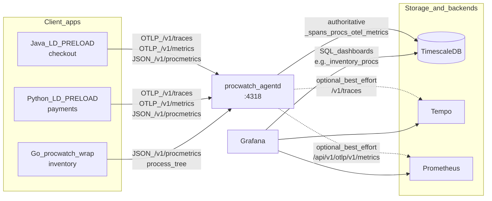

# ProcWatch
This is a simple application that monitors system processes and stores the data in a PostgreSQL database in TimescaleDB format. The data is then visualized using Grafana or other tools.

## Configure Postgres Server

### Install Postgres server and extensions
```bash
sudo apt install postgresql postgresql-contrib
sudo apt install postgresql-16-timescaledb-2 postgresql-16-cron
```

### Create database and user
```bash
# login to postgres
sudo -u postgres psql
```
```sql
CREATE DATABASE procwatcherdb;
CREATE USER procwatcher WITH PASSWORD 'procwatcher';
GRANT ALL PRIVILEGES ON DATABASE procwatcherdb TO procwatcher;
```

### Update `/etc/postgresql/16/main/pg_hba.conf`
- For local connection, add a line at the top of the "local" section:
  ```
  local   procwatcherdb   procwatcher   trust
  ```
- For network connection, add:
  ```
  host    procwatcherdb   procwatcher   all    md5
  ```

### Configure Postgres extensions
- Edit `/etc/postgresql/16/main/postgresql.conf`:
  - Add `shared_preload_libraries = 'pg_cron, timescaledb'`
  - Add `cron.database_name = 'procwatcherdb'` to allow creating the extension in databases other than `postgres`
- Enable the `pg_cron` extension for the target database:
  ```bash
  sudo -u postgres psql -d procwatcherdb -c "CREATE EXTENSION IF NOT EXISTS pg_cron;"
  ```
- Allow the user to do everything with the new `cron` schema:
  ```bash
  sudo -u postgres psql -d procwatcherdb -c "GRANT ALL ON SCHEMA cron TO procwatcher;"
  ```
- Restart Postgres:
  ```bash
  sudo systemctl restart postgresql
  ```

## Run Application

- Install the Postgres client library in the target environment:
  ```bash
  sudo apt install libpq-dev
  ```
- Build the application for both x86_64 and aarch64:
  ```bash
  make all
  ```
- Run the application:
  ```bash
  <binary_path> -c <command> -i <telemetry_collection_interval> -l <app_label> -d <database_connection_string> -s <database_schema>
  ```
  `<database_schema>` and `<app_label>` are used to identify the application in the database. They are used in the query of Grafana to filter the data.

## Use Grafana to Visualize Data

1. Install Grafana:
   ```bash
   sudo apt install grafana
   ```
2. Start and enable Grafana:
   ```bash
   sudo systemctl start grafana-server
   sudo systemctl enable grafana-server
   ```
3. Access Grafana at `http://<grafana_server_ip>:3000`.
4. Create a dashboard and add panels for visualization.
5. Configure each panel's query and transformation:

   **Query — visualize CPU usage:**
   ```sql
   SELECT
     ts AS time,
     pid AS metric,
     cpu_pct AS pid
   FROM <database_schema>.<table_name>
   WHERE $__timeFilter(ts)
   ORDER BY ts, metric;
   ```

   **Query — visualize memory usage:**
   ```sql
   SELECT
     ts AS time,
     pid AS metric,
     rss_kb AS pid
   FROM <database_schema>.<table_name>
   WHERE $__timeFilter(ts)
   ORDER BY ts, metric;
   ```

   **Transformation:** `Prepare time series`
   - Format: `Multi-frame time series`

## Test Application

- Run the test application:
  ```bash
  <procwatch_binary_path> -c "python3 test.py" -i 5 -l "test_app" -d "<database_connection_string>" -s "<database_schema>"
  ```

---

# Auto-Instrumentation Agent

A second, optional set of artifacts adds Dynatrace-OneAgent-style automatic
instrumentation for containerised workloads: applications get distributed
traces without their images, code, or startup commands being modified.

This is entirely additive. `make all`, `scripts/build.sh`, and the `procwatch`
binary are unchanged; the agent has its own sources, build script, and Make
targets.

## What gets built

| Artifact | Role |
| --- | --- |
| `libprocwatch_inject.so` | `LD_PRELOAD` library: runtime env bootstrap, OTEL label attachment, metric pthread (any process, not just Java/Python), execve env maintenance. |
| `procwatch-wrap` | Parent sampler for static binaries (e.g. Go): fork/exec the app, sample `/proc/<child>`, POST the same JSON. |
| `procwatch-agentd` | Receives OTLP/HTTP and `POST /v1/procmetrics`; creates `<label>_spans` / `<label>_procs` / `<label>_otel_metrics` on first sight. Optionally dual-exports OTLP traces to Tempo and OTLP metrics to Prometheus when endpoints are configured. |
| `java/javaagent.jar` | Upstream OpenTelemetry Java agent, loaded via `-javaagent`. |
| `python/` | `sitecustomize.py` shim plus per-ABI vendored OpenTelemetry packages. |

### Architecture



- **Java / Python**: `LD_PRELOAD` injects OTEL bootstrap + a metric thread. Apps send OTLP traces/metrics and `/v1/procmetrics` to `agentd`.
- **Go (static)**: `procwatch-wrap` samples the process tree and POSTs `/v1/procmetrics` only (no OTLP traces).
- **agentd**: always writes Timescale (`<label>_spans` / `_procs` / `_otel_metrics`). When `PROCWATCH_TEMPO_ENDPOINT` / `PROCWATCH_PROMETHEUS_ENDPOINT` are set, it also best-effort forwards decoded OTLP.
- **Grafana**: Explore Tempo (traces) and Prometheus (OTLP metrics); SQL panels against Timescale for wrap/`_procs` data (e.g. Inventory Go dashboard).

Tables are keyed by each payload’s `PROCWATCH_LABEL` (also attached to OTLP as
`procwatch.label`). `agentd` does not take `-l`; the first payload for a label
creates `<label>_procs` / `<label>_spans` / `<label>_otel_metrics`. Process
metrics (`_procs`) are pushed by the inject metric thread or `procwatch-wrap`
as plain JSON over `/v1/procmetrics`. The inject metric thread starts for
*any* dynamically linked process that loads the injector and carries a valid
`PROCWATCH_LABEL`, regardless of runtime — it needs no OTel SDK, so it also
covers processes the runtime detector doesn't recognize as Java/Python.
`procwatch-wrap` remains the only option for statically linked binaries
(e.g. Go with `CGO_ENABLED=0`), since those never load `LD_PRELOAD` objects
at all. OTLP metrics (`_otel_metrics`) come from the Java/Python OpenTelemetry
SDKs over standard `/v1/metrics`, one row per decoded data point (Gauge and
Sum points keep their instantaneous value; Histogram points are flattened to
their count + sum, individual buckets are dropped). `agentd` only receives
data over HTTP in both cases.

### `_procs` vs `_otel_metrics`: which one has what

Both auto-instrumentation runtimes now emit metrics that overlap with what
`_procs` already covers (CPU%, RSS, thread count), plus signals `_procs`
does not:

| Metric | `_procs` (procwatch sampling) | `_otel_metrics` (OTLP SDK) |
| --- | --- | --- |
| CPU usage | `cpu_pct`, from `/proc` deltas, all runtimes incl. Go | `process.cpu.percent` (Python) / JVM CPU (Java), same "percent of one core" convention |
| Memory (RSS) | `rss_kb` | `process.resident_memory.bytes` (Python) / JVM heap+non-heap (Java) |
| Threads | `threads` | `process.threads` (Python) / JVM thread count (Java) |
| Process instance key | `pid`, `"<pid>_<YYYYMMDDHHMMSS>"` | `pid`, same `"<pid>_<YYYYMMDDHHMMSS>"` format, from the `procwatch.pid_key` resource attribute the injector attaches |
| Virtual memory, open fds, GC stats, interpreter/JVM info | not collected | `process.virtual_memory.bytes`, `process.open_fds`, `python.gc.*` / JVM GC metrics, `python.info` |
| Works for static Go binaries | Yes, via `procwatch-wrap` | No; no OTel SDK in the binary |

`_procs` remains the language-agnostic baseline (including Go, C, or any
static binary with no OTel SDK); `_otel_metrics` adds richer, SDK-native
signals for Java and Python specifically, on the same OTLP metrics pipeline
already used for traces. Java's JVM runtime metrics (memory, GC, threads,
CPU) are emitted automatically by the upstream javaagent — no code change
needed beyond `OTEL_INSTRUMENTATION_RUNTIME_TELEMETRY_ENABLED=true`, which
the injector sets by default. Python's process metrics are registered
explicitly in `runtime/python/sitecustomize.py` after auto-instrumentation
initializes, using the same `opentelemetry.metrics` meter the vendored SDK
already ships.

## How injection works

Requires a valid `PROCWATCH_LABEL` (`^[A-Za-z0-9_]+$`). Without it the injector
skips OTEL bootstrap and the metric thread. The metric thread itself is
armed for every process that reaches this point, independent of runtime
detection; only the OTEL env bootstrap (`-javaagent`, `PYTHONPATH` shim, and
the `procwatch.pid_key` resource attribute described below) stays gated on
detecting Java/Python, since that part is genuinely runtime-specific.

The ELF constructor (before `main`):

1. Checks the kill switch `PROCWATCH_INJECT_DISABLED=1`.
2. Checks `PROCWATCH_LABEL` is present and valid; arms the metric thread if so.
3. Detects the runtime by executable basename (`getauxval(AT_EXECFN)`), then
   confirms it with `dlsym` (`JLI_Launch` / `Py_BytesMain`). Unrecognized
   executables fall through as runtime `"other"` — the metric thread still
   runs for them, only the OTEL bootstrap below is skipped.
4. For Java/Python only: rewrites the environment idempotently, appends
   `procwatch.label=<label>` to `OTEL_RESOURCE_ATTRIBUTES`, and sets
   `procwatch.pid_key=<pid>_<YYYYMMDDHHMMSS>` there too (replacing any stale
   value inherited from a parent process, since a genuinely new child has
   its own pid).

Separately, `__libc_start_main` is interposed so a detached metric pthread
starts *after* the loader lock and *before* application `main`, for any
process that armed it in step 2 above — independent of runtime. The thread
samples `/proc/self` every `PROCWATCH_METRIC_INTERVAL` (default 10s) and POSTs
JSON to `{PROCWATCH_ENDPOINT}/v1/procmetrics` over raw sockets (no libcurl).

`execve` / `execvpe` / `execveat` are interposed so a rebuilt `envp` still
carries `PROCWATCH_LABEL`, `LD_PRELOAD`, and related vars across process-tree
re-execs (e.g. the JDK launcher).

Idempotency is mandatory: the JDK re-execs itself, so the constructor runs
more than once per `java` invocation.

## Runtime support and limits

| Runtime | Traces | Process metrics (`_procs`) | OTLP metrics (`_otel_metrics`) | Notes |
| --- | --- | --- | --- | --- |
| Java 8+ | Yes | Yes (inject thread) | Yes (JVM runtime metrics, built into the javaagent) | Upstream OpenTelemetry Java agent. |
| CPython 3.x | Yes | Yes (inject thread) | Yes (registered in `sitecustomize.py`) | Vendored tree must match interpreter minor + libc. |
| Other dynamically linked binaries (Node.js, Ruby, C/C++, dynamic Go, …) | No | Yes (inject thread) | No | Not runtime-detected, so no OTEL bootstrap; the metric thread still starts as long as the binary loads `LD_PRELOAD` and has a valid `PROCWATCH_LABEL`. |
| Static Go (`CGO_ENABLED=0`) | **No** | Yes (`procwatch-wrap`) | **No** | No `PT_INTERP`; the injector can never load, so `procwatch-wrap` is required regardless of the row above. |

**Statically linked binaries cannot get the in-process metric thread via
`LD_PRELOAD`.** There is no dynamic linker, so the injector never loads —
this applies no matter how permissive runtime detection is. Use
`command: ["/opt/procwatch/agent/bin/procwatch-wrap", "--", "<app>", …]` with
the same `PROCWATCH_LABEL` / `PROCWATCH_ENDPOINT`. For traces from such a
binary, use the OpenTelemetry SDK in-app or a privileged eBPF agent; both are
out of scope here.

Other cases deliberately not handled:

- **setuid/setgid binaries.** The loader strips `LD_PRELOAD` under `AT_SECURE`.
- **Python ABI matching.** Build the trees you need with
  `PYTHON_VERSIONS="3.11 3.12" make runtimes`.
- **Alpine/musl images need the musl injector**
  (`build/agent/<arch>-musl/lib/…`). A glibc `.so` is a silent no-op on musl.
- **Automatic Go entrypoint rewrite.** Manifests must use `procwatch-wrap`
  manually (no mutating webhook yet).

The injector links with `-Wl,--no-undefined`, keeps libc as its only
`DT_NEEDED`, and exports only the interposed symbols (`__libc_start_main`,
`execve`, `execvpe`, `execveat`). An unresolved preload symbol aborts every
process with exit 127.
## Building

```bash
make runtimes           # download the Java agent and build the Python trees
make agent-x86_64       # agentd + glibc injector + wrap
make agent-musl-x86_64  # musl injector + musl-static wrap (needed for Alpine Go)
make agent              # all arches (glibc + musl)
make world              # everything, including the original procwatch binary
make example-up         # rebuild runtimes+agent and start examples/docker-compose.yml
make example-down       # tear down the example compose project
```

`procwatch-wrap` must be the musl-static build to run inside Alpine/scratch Go
images; `make agent-musl-x86_64` writes that binary into
`build/agent/x86_64/bin/procwatch-wrap`.

`make all` still builds only the `procwatch` binary.

The bundle lands in `build/agent/<arch>/`, self-contained in the same way as
the existing binary: `libpq` and its transitive dependencies are copied into
`lib/` and found through a `$ORIGIN/lib` rpath.

## Running locally

```bash
make example-up      # fetch runtimes, rebuild agent, start the compose stack
make example-down    # tear down the example environment
```

Grafana is at `http://localhost:3001` (admin/admin). The compose project name
defaults to `pwdemo` (`EXAMPLE_PROJECT` / `-p`).

Dashboards → **ProcWatch / ProcWatch Inventory (Go)** plots
`procwatch.inventory_procs` from the TimescaleDB datasource (CPU / RSS /
threads by `pid`, including wrap-sampled worker children).

Manual equivalent:

```bash
make runtimes && make agent-x86_64 && make agent-musl-x86_64
docker compose -f examples/docker-compose.yml -p pwdemo up --build
```

Java/Python produce spans and inject-thread metrics into `checkout_*` /
`payments_*`. Go uses `procwatch-wrap` and lands metrics in `inventory_procs`.
`agentd` is started with no `-l`; tables appear on first payload.

The compose stack also starts **Grafana** (`http://localhost:3001`, admin/admin),
**Tempo**, and **Prometheus**. `agentd` dual-exports OTLP traces to Tempo and
OTLP metrics to Prometheus via `PROCWATCH_TEMPO_ENDPOINT` /
`PROCWATCH_PROMETHEUS_ENDPOINT` (best-effort; Timescale stays authoritative).
Use Grafana Explore with the Tempo and Prometheus datasources. Unset those
env vars on `agentd` to disable forwarding.

Standalone:

```bash
procwatch-agentd -P 4318 -s procwatch -d "<conn_str>"
```

| Flag | Env | Default | Meaning |
| --- | --- | --- | --- |
| `-b` | `PROCWATCH_BIND` | `0.0.0.0` | Listen address |
| `-P` | `PROCWATCH_PORT` | `4318` | OTLP/HTTP + procmetrics port |
| `-s` | `PROCWATCH_SCHEMA` | `procwatch` | Schema |
| `-d` | `PROCWATCH_DB` | see `-h` | Connection string |
| `-R` | `PROCWATCH_RETENTION_HOURS` | `168` | Timescale chunk retention (hours) |
| `-T` | `PROCWATCH_INACTIVE_HOURS` | `720` | Drop tables with no writes for this many hours |
| `-t` | `PROCWATCH_TEMPO_ENDPOINT` | unset | Optional Tempo OTLP/HTTP traces URL (`http://host:port/v1/traces`); best-effort forward |
| `-m` | `PROCWATCH_PROMETHEUS_ENDPOINT` | unset | Optional Prometheus OTLP metrics URL (`http://host:port/api/v1/otlp/v1/metrics`); best-effort forward |

When `-t` / `-m` (or the env vars) are set to a valid `http://` URL, agentd
POSTs the same decoded OTLP protobuf body after writing Timescale. Forward
failures are ignored and never change the client response; unset the vars to
disable. HTTPS is not supported by the forwarder.

### systemd

```bash
make agent-x86_64
sudo useradd --system --home /var/lib/procwatch --shell /usr/sbin/nologin procwatch
sudo mkdir -p /opt/procwatch /etc/procwatch /var/lib/procwatch/spill
sudo cp build/agent/x86_64/procwatch-agentd /opt/procwatch/
sudo cp -a build/agent/x86_64/lib /opt/procwatch/
sudo cp deploy/systemd/agentd.env.example /etc/procwatch/agentd.env
# edit PROCWATCH_DB (and optional -R/-T via env) in /etc/procwatch/agentd.env
sudo chown -R procwatch:procwatch /var/lib/procwatch
sudo chmod 0640 /etc/procwatch/agentd.env
sudo cp deploy/systemd/procwatch-agentd.service /etc/systemd/system/
sudo systemctl daemon-reload
sudo systemctl enable --now procwatch-agentd
sudo systemctl status procwatch-agentd
```

The unit reads `/etc/procwatch/agentd.env`, runs as user `procwatch`, and spills
offline data under `/var/lib/procwatch/spill`. Logs go to the journal
(`journalctl -u procwatch-agentd -f`).

Application / wrap env:

| Variable | Purpose |
| --- | --- |
| `PROCWATCH_LABEL` | **Required.** Table key; also set as OTLP `procwatch.label` |
| `PROCWATCH_INJECT_DISABLED=1` | Kill switch; skips injection + metric thread |
| `PROCWATCH_INJECT_DEBUG=1` | Log injection decisions to stderr |
| `PROCWATCH_AGENT_DIR` | Agent tree location (default `/opt/procwatch/agent`) |
| `PROCWATCH_ENDPOINT` | Collector base URL (default `http://127.0.0.1:4318`) |
| `PROCWATCH_SERVICE` | Service name on metrics (and OTEL service.name when set) |
| `PROCWATCH_METRIC_INTERVAL` | Inject/wrap sample period, seconds (default 10) |
| `PROCWATCH_SPILL_DIR` | Offline NDJSON spill directory (default `/var/tmp/procwatch`) |

## Kubernetes

```bash
kubectl apply -f deploy/k8s/example-apps-deployment.yaml
```

The example Deployment is a single pod with `agentd`, Java, Python, and Go.
Apps send OTLP and `/v1/procmetrics` to `http://127.0.0.1:4318` (shared
network namespace). Java/Python set `LD_PRELOAD`; Go uses `procwatch-wrap`.
Each app container requires its own `PROCWATCH_LABEL` and binds a distinct
`PORT`. Replace the `procwatch-db` Secret with your TimescaleDB connection
string before applying.

## Schema

Tables are created dynamically per label. Hypertables use chunk retention
controlled by `-R` / `PROCWATCH_RETENTION_HOURS` (default **168** hours).
`drop_inactive_tables` removes tables with no writes for `-T` /
`PROCWATCH_INACTIVE_HOURS` (default **720** hours). Both apply to the classic
`procwatch` binary as well (`-R` / `-T`). The `<schema>.<label>` table used by
standalone `procwatch` is untouched.

If TimescaleDB is unreachable, `procwatch` and `agentd` append records to an
NDJSON spill file under `PROCWATCH_SPILL_DIR` (default `/var/tmp/procwatch`),
retry the connection about every 5 seconds, and flush the spill in order once
the database is back.

`<schema>.<label>_spans`:

| Column | Type | Notes |
| --- | --- | --- |
| `ts` | `TIMESTAMPTZ` | Span end time, not ingest time |
| `trace_id`, `span_id`, `parent_span_id` | `TEXT` | Lowercase hex; parent is `NULL` for roots |
| `name`, `kind`, `service_name`, `scope_name` | `TEXT` | `kind` is `SERVER`/`CLIENT`/… |
| `duration_ns` | `BIGINT` | |
| `status_code`, `status_message` | `TEXT` | `UNSET`/`OK`/`ERROR` |
| `attributes` | `JSONB` | Full span attributes |

`<schema>.<label>_procs`: `ts`, `service_name`, `container_id`, `pod`, `pid`
(TEXT series key, typically `<pid>_<YYYYMMDDHHMMSS>` from the inject/wrap
sampler start), `comm`, `runtime`, `cpu_pct`, `rss_kb`, `threads`.

`<schema>.<label>_otel_metrics`: `ts`, `service_name`, `scope_name`, `pid`
(TEXT series key, same `<pid>_<YYYYMMDDHHMMSS>` format as `_procs`, from the
`procwatch.pid_key` resource attribute; empty if the SDK's resource lacked
one), `metric_name`, `metric_type` (`gauge`/`sum`/`histogram`), `description`,
`unit`, `value` (instantaneous value, or sum for histograms), `count`
(histogram point count; `1` for gauge/sum), `attributes` (`JSONB`).

`service_name` joins all three tables. Spans without `procwatch.label` are
rejected so unlabeled data cannot land in a mystery table.
## Grafana queries for traces

**Slowest operations:**

```sql
SELECT
  service_name || ' ' || name AS operation,
  count(*)                                        AS calls,
  round(avg(duration_ns) / 1e6, 1)                AS avg_ms,
  round((percentile_disc(0.95) WITHIN GROUP (ORDER BY duration_ns)) / 1e6, 1) AS p95_ms
FROM <schema>.<label>_spans
WHERE $__timeFilter(ts)
GROUP BY 1
ORDER BY p95_ms DESC
LIMIT 20;
```

**Error rate over time:**

```sql
SELECT
  time_bucket('1 minute', ts) AS time,
  service_name                AS metric,
  100.0 * count(*) FILTER (WHERE status_code = 'ERROR') / NULLIF(count(*), 0) AS value
FROM <schema>.<label>_spans
WHERE $__timeFilter(ts)
GROUP BY 1, 2
ORDER BY 1;
```

**One full trace, ordered as a waterfall:**

```sql
SELECT
  ts, service_name, name, kind,
  duration_ns / 1e6 AS ms,
  status_code, span_id, parent_span_id
FROM <schema>.<label>_spans
WHERE trace_id = '$trace_id'
ORDER BY ts;
```

**Filter on a span attribute** (`attributes` is `JSONB`, so it indexes and
queries like any other JSONB column):

```sql
SELECT ts, service_name, name, attributes ->> 'http.route' AS route
FROM <schema>.<label>_spans
WHERE $__timeFilter(ts)
  AND attributes ->> 'http.status_code' = '500'
ORDER BY ts DESC;
```

**Traces and process metrics side by side**, joined on the service name. The
join is `FULL` so that Go services, which have metrics but no spans, still
appear as rows with a CPU value and no latency:

```sql
WITH spans AS (
  SELECT time_bucket('1 minute', ts) AS bucket, service_name,
         round(avg(duration_ns) / 1e6, 1) AS latency_ms
  FROM <schema>.<label>_spans
  WHERE $__timeFilter(ts)
  GROUP BY 1, 2
),
procs AS (
  SELECT time_bucket('1 minute', ts) AS bucket, service_name,
         round(avg(cpu_pct)::numeric, 1) AS cpu_pct
  FROM <schema>.<label>_procs
  WHERE $__timeFilter(ts)
  GROUP BY 1, 2
)
SELECT
  COALESCE(s.bucket, p.bucket)             AS time,
  COALESCE(s.service_name, p.service_name) AS metric,
  s.latency_ms,
  p.cpu_pct
FROM spans s
FULL JOIN procs p
  ON p.bucket = s.bucket AND p.service_name = s.service_name
ORDER BY 1;
```

## Troubleshooting

Set `PROCWATCH_INJECT_DEBUG=1` on the application; the injector and the Python
shim both explain what they decided.

| Symptom | Likely cause |
| --- | --- |
| Injector skips everything | Missing/invalid `PROCWATCH_LABEL` |
| `java -version` does not print `Picked up JAVA_TOOL_OPTIONS` | `LD_PRELOAD` not set, wrong path, or a setuid binary |
| Java starts but no spans | `javaagent.jar` missing; injector skips a `-javaagent` it cannot find |
| Python initialises but emits no spans | No `cp3XX` tree for that interpreter |
| No spans from an Alpine pod | Using glibc injector instead of musl |
| Spans rejected / no `_spans` table | OTLP resource missing `procwatch.label` (injector did not attach it) |
| No `_procs` rows | Endpoint unreachable from the inject thread / wrap, or label never POSTed |
| Go has no metrics | Entrypoint not wrapped with `procwatch-wrap` |
</content>
</invoke>
